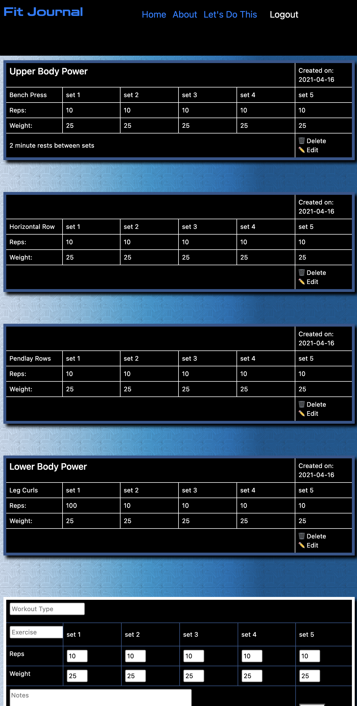

# Fit Journal

An app that lets you easily track your workout program so you can gain better results. This app was created because I tried to track my workouts several different ways, and the most convenient was to type them onto my phone's note app. That was convenient but took too long and wasn't enjoyable.

Fit Journal is a free open source app that allows logged in users to keep track of their exercises, number of sets, reps, and weights used for each set.

### `Technologies, Libraries, Apps, and Services Used`

Front-end: React
Back end: Nodejs, Express, Mongoose
Database: MongoDB
Bootstrap React
Adobe Illustrator
Favicon.cc
Pexels.com
Transparenttextures.com
Github
Heroku
Netlify
Firebase

### `Getting Started`

See the [deployed app here](https://fitjournal.netlify.app/).

See the [trello board.](https://trello.com/b/ZZnIcsmD/fit-journal).

Go to the [front-end github repository](https://github.com/paeshi/workout-app-frontend).

Go to the [back end github repository](https://github.com/paeshi/workout-app-be).

### `Current Preview`

### `Unsolved Problems`

This app is currently a working minimun viable product.  
Issues include:

- Ability to create extra sets.
- Datalist does not allow you to use the dropdown if the user changes their mind and wants to manually type in an exercise.
- Navigation bar needs better styling.
- Forms and tables need styling upgrades.

## Future Enhancements

- Seperately store and access each days workout.
- Graph of data from the history of workouts logged.
- Links to exercise descriptions.
